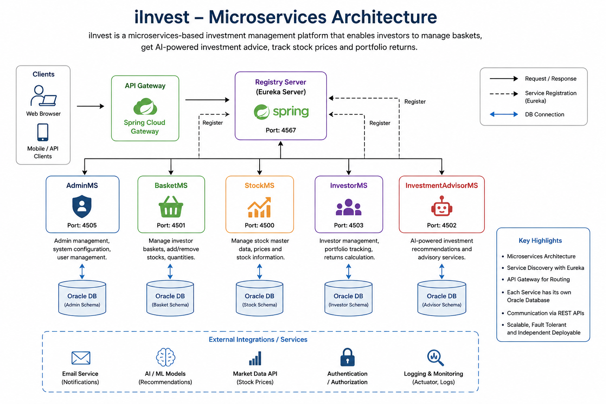
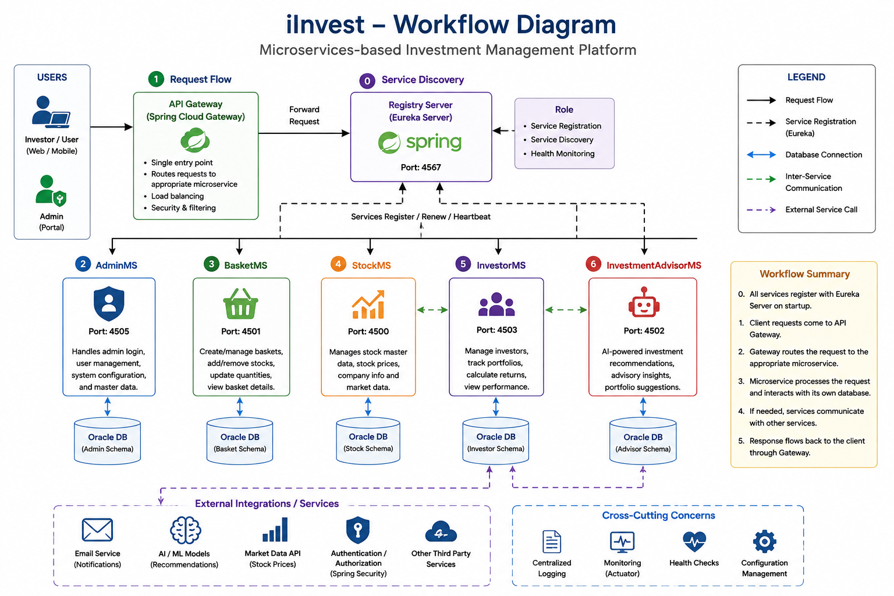

# iInvest

### Microservices-Based Investment Management Platform

iInvest is a Java-based microservices application for managing investment-related operations through six independent Spring Boot services:

- **AdminMS** — administration functionality
- **BasketMS** — investment basket management
- **InvestmentAdvisorMS** — investment advisor functionality
- **InvestorMS** — investor-related operations
- **StockMS** — stock-related operations
- **RegistryServer** — service registration and discovery using Eureka

The system uses **Spring Boot, Spring Cloud Netflix Eureka, Oracle Database, Spring Data JPA/JDBC, Spring MVC, Maven, and Java 21**.

---

## Architecture



The application separates investment-related capabilities into independently maintained services. Eureka provides service registration and discovery.

---

## Workflow



A typical request follows a layered service flow:

```text
Client / Application
        ↓
Controller / REST API
        ↓
Service Layer
        ↓
Persistence / Other Service
        ↓
Oracle Database
```

Service discovery is handled through the Eureka Registry Server.

---

## Microservices

### AdminMS

Provides administration-related functionality.

Includes:

- Admin model
- Admin repository
- Admin service
- Admin controller
- REST controller
- Security configuration
- JSP administration views
- Static web resources

Configured port: **4505**

### BasketMS

Provides investment basket functionality.

Includes:

- Basket model
- Stock quantity model
- Basket controller
- Basket service
- Database persistence

Configured port: **4501**

### InvestmentAdvisorMS

Provides investment advisor functionality.

Includes:

- Investment advisor model
- Stock input model
- Investment advisor controller
- Investment advisor service

### InvestorMS

Provides investor-related functionality.

Includes:

- Investor model
- Investor basket
- Basket value
- Returns
- Investor controller
- Investor service

Configured port: **4503**

### StockMS

Provides stock-related functionality.

Includes:

- Stock model
- Stock controller
- Stock service

Configured port: **4500**

### RegistryServer

Provides Eureka-based service registration and discovery.

Configured as the Eureka server with:

```text
Port: 4567
Eureka: http://localhost:4567/eureka/
```

---

## Technology Stack

| Category | Technology |
|---|---|
| Language | Java 21 |
| Backend | Spring Boot 3.3.4 |
| Microservices | Spring Boot |
| Service Discovery | Spring Cloud Netflix Eureka |
| Spring Cloud | 2023.0.3 |
| Database | Oracle Database |
| Persistence | Spring Data JPA / JDBC |
| Web | Spring MVC |
| Views | JSP / JSTL |
| API Documentation | Springdoc OpenAPI |
| Monitoring | Spring Boot Actuator |
| Build Tool | Maven |
| Application Server | Tomcat |
| Testing | Spring Boot Test |

The Maven configuration uses Spring Boot 3.3.4, Java 21, Spring Cloud 2023.0.3, Eureka Client, JPA, Oracle JDBC, Springdoc OpenAPI, and Actuator. fileciteturn2file0L7-L18 fileciteturn2file0L32-L53

---

## Service Discovery

The services use **Spring Cloud Netflix Eureka** for registration and discovery.

```text
                    RegistryServer
                         │
                         ▼
                 ┌───────────────┐
                 │ Eureka Server │
                 │    :4567      │
                 └───────┬───────┘
                         │
          ┌──────────────┼──────────────┐
          ▼              ▼              ▼
       AdminMS        BasketMS        StockMS
          │              │              │
          ├──────────────┼──────────────┤
          ▼              ▼              ▼
      InvestorMS   InvestmentAdvisorMS  ...
```

Client services are configured to use:

```text
http://localhost:4567/eureka/
```

---

## Database

The services use Oracle Database through the Oracle JDBC driver and Spring persistence technologies.

Database configuration uses environment variables rather than storing credentials in source control:

```yaml
spring:
  datasource:
    url: jdbc:oracle:thin:@//localhost:1521/xe
    username: ${DB_USERNAME}
    password: ${DB_PASSWORD}
    driver-class-name: oracle.jdbc.OracleDriver
```

Set the following variables locally:

```text
DB_USERNAME
DB_PASSWORD
```

**Never commit real database credentials, API keys, or other secrets.**

---

## Application Ports

| Service | Port |
|---|---:|
| RegistryServer | 4567 |
| StockMS | 4500 |
| BasketMS | 4501 |
| InvestorMS | 4503 |
| AdminMS | 4505 |

The exact runtime port for InvestmentAdvisorMS should be taken from its `application.yml`.

---

## Project Structure

```text
iInvest/
│
├── .gitignore
│
├── AdminMS/
│   ├── .mvn/
│   ├── mvnw
│   ├── mvnw.cmd
│   ├── pom.xml
│   └── src/
│       ├── main/
│       │   ├── java/com/ofss/
│       │   │   ├── AdminMsApplication.java
│       │   │   ├── AdminRepository.java
│       │   │   ├── ServletInitializer.java
│       │   │   ├── api/
│       │   │   ├── configuration/
│       │   │   ├── controller/
│       │   │   ├── model/
│       │   │   └── service/
│       │   ├── resources/
│       │   └── webapp/
│       │       └── WEB-INF/jsp/
│       └── test/
│
├── BasketMS/
│   ├── .mvn/
│   ├── mvnw
│   ├── mvnw.cmd
│   ├── pom.xml
│   └── src/
│       ├── main/
│       └── test/
│
├── InvestmentAdvisorMS/
│   ├── .mvn/
│   ├── mvnw
│   ├── mvnw.cmd
│   ├── pom.xml
│   └── src/
│       ├── main/
│       └── test/
│
├── InvestorMS/
│   ├── .mvn/
│   ├── mvnw
│   ├── mvnw.cmd
│   ├── pom.xml
│   └── src/
│       ├── main/
│       └── test/
│
├── RegistryServer/
│   ├── .mvn/
│   ├── mvnw
│   ├── mvnw.cmd
│   ├── pom.xml
│   └── src/main/
│
└── StockMS/
    ├── .mvn/
    ├── mvnw
    ├── mvnw.cmd
    ├── pom.xml
    └── src/
        ├── main/
        └── test/
```

Generated Maven `target/` directories and IDE metadata are excluded from version control.

---

## Installation

### Prerequisites

- Java 21
- Oracle Database / Oracle XE
- Git
- Maven, or the included Maven Wrapper

Verify Java:

```bash
java -version
```

### Clone

```bash
git clone https://github.com/JNSathyasri/iInvest.git
cd iInvest
```

### Configure Database Credentials

#### Windows CMD

```cmd
set DB_USERNAME=your_oracle_username
set DB_PASSWORD=your_oracle_password
```

#### PowerShell

```powershell
$env:DB_USERNAME="your_oracle_username"
$env:DB_PASSWORD="your_oracle_password"
```

#### Linux / macOS

```bash
export DB_USERNAME=your_oracle_username
export DB_PASSWORD=your_oracle_password
```

---

## Running the Application

Start the RegistryServer first:

```bash
cd RegistryServer
mvnw.cmd spring-boot:run
```

Then start the application services individually.

Example:

```bash
cd StockMS
mvnw.cmd spring-boot:run
```

```bash
cd BasketMS
mvnw.cmd spring-boot:run
```

```bash
cd InvestorMS
mvnw.cmd spring-boot:run
```

```bash
cd InvestmentAdvisorMS
mvnw.cmd spring-boot:run
```

```bash
cd AdminMS
mvnw.cmd spring-boot:run
```

The services register with Eureka according to their configurations.

---

## Maven Commands

Build an individual service:

```bash
cd StockMS
mvnw.cmd clean install
```

Run tests:

```bash
mvnw.cmd test
```

Run the service:

```bash
mvnw.cmd spring-boot:run
```

The same commands can be used inside the other service directories.

---

## API Layer

The project uses Spring controllers to expose service functionality.

Examples include:

- `AdminController`
- `AdminRestController`
- `BasketController`
- `IAController`
- `InvestorController`
- `StockController`

AdminMS also contains security configuration and JSP-based administration views.

---

## Testing

The services contain Spring Boot tests under:

```text
src/test/java/
```

Tests can be executed with:

```bash
mvnw.cmd test
```

---

## Key Engineering Concepts

This project demonstrates:

- Microservice architecture
- Service discovery
- Spring Boot development
- Spring Cloud
- Eureka
- REST APIs
- Layered architecture
- Dependency injection
- Spring Data JPA
- Spring JDBC
- Oracle database integration
- Maven project management
- Environment-based configuration
- Automated testing
- JSP-based web views
- API documentation

---

## Future Improvements

Potential improvements include:

- API Gateway
- Centralized configuration
- Distributed tracing
- Centralized logging
- Docker containerization
- Kubernetes deployment
- CI/CD pipeline
- JWT/OAuth2 authentication
- Circuit breakers and resilience patterns
- Centralized secrets management
- Cloud deployment
- Enhanced integration testing
- Monitoring dashboards

---

## Author

**J N Sathyasri**

M.Tech Computer Science Engineering

**Interests:** Software Development • Backend Engineering • Java • Spring Boot • Microservices • AI/ML • Generative AI • MLOps

GitHub: [JNSathyasri](https://github.com/JNSathyasri)
